# Composite Action Extractor
A method of extracting action segments / composite actions by calculating either the entropy, distance, or divergence in 
probability distributions over state and action spaces, then correlating spikes in those measurements in the action spaces
with the spikes in the measurements in the state space.

## Installation 
`git clone https://github.com/josiahls/CompositeActionExtractor.git`

`cd CompositeActionExtractor`

`python setup.py install`

And then run any of the notebooks in the `notebooks` directory. 
The notebook `composite_action_extractor/notebooks/Data Analysis [Action - State Values].ipynb` should explain what the data should look like for importing.

## Results
We are going to use Cartpole as a detailed example. There are many more environments we want to test, 
however in our preliminary results, we tested nine environments.

Given a set of Cartpole Values (described in `Data Analysis [Action - State Values].ipynb`):
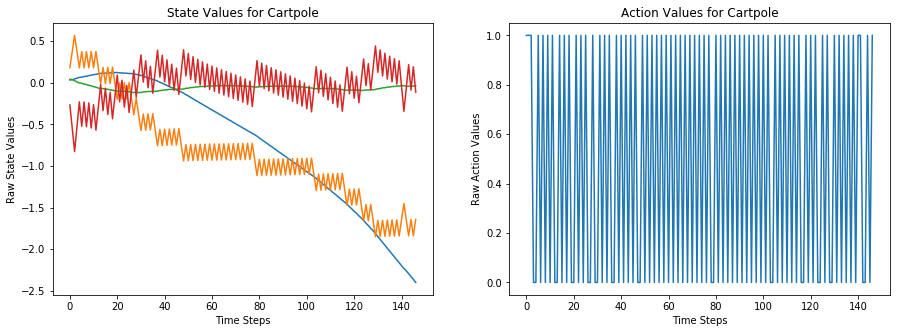

We can analyze the divergence, entropy, or measure of both of these distributions via binning,
then probability calculation.
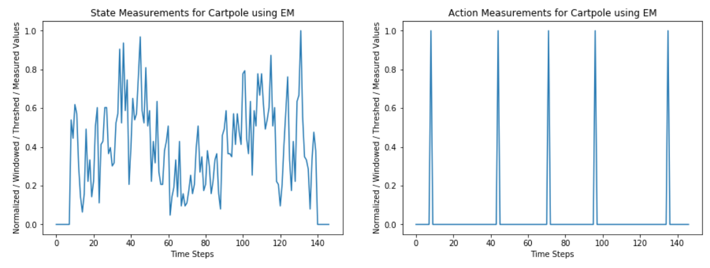

If we compare changes in the action space with the values in the state space we get:
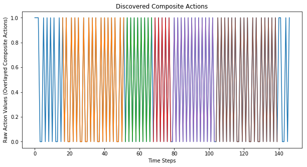

From here our method determined that were are 5 possible composite actions. Our method also outputs the 
values generated from this analysis, and so we could filter these farther if we wanted to.

Below are our results of running our method on nine OpenAI environments:
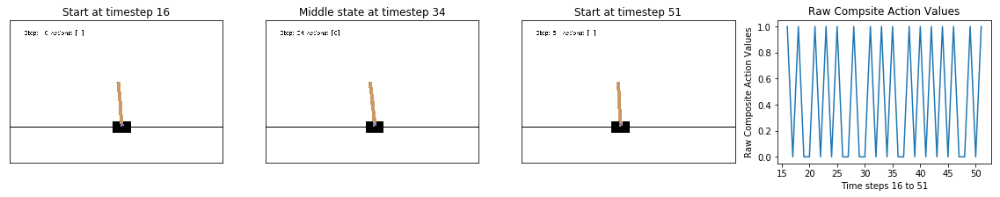
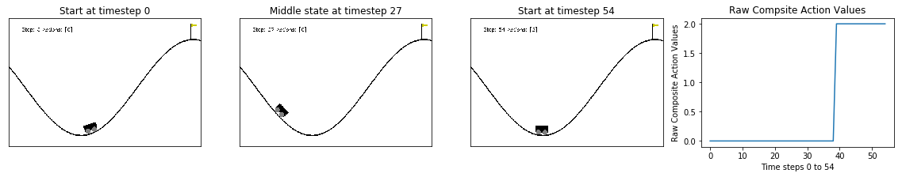
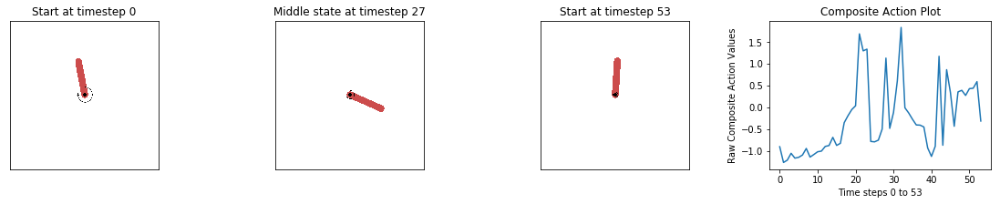
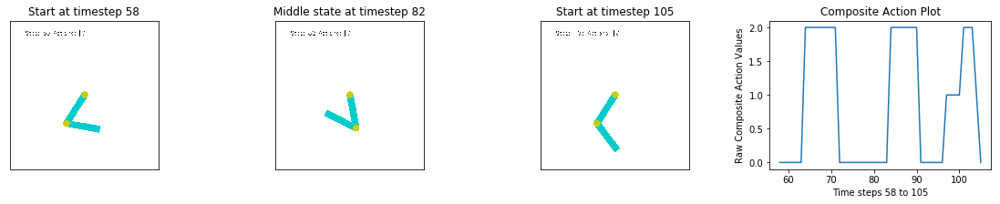
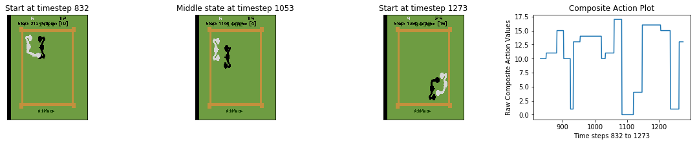
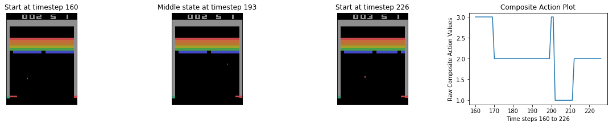
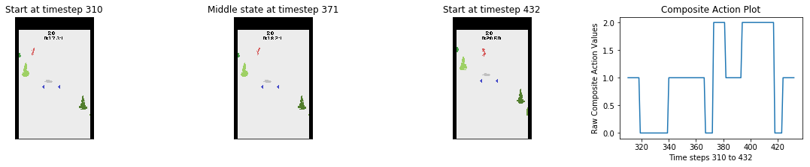
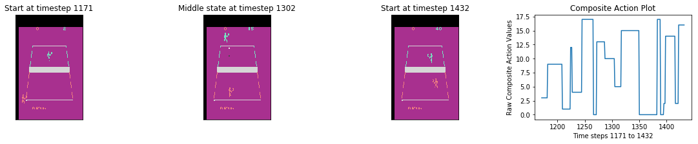
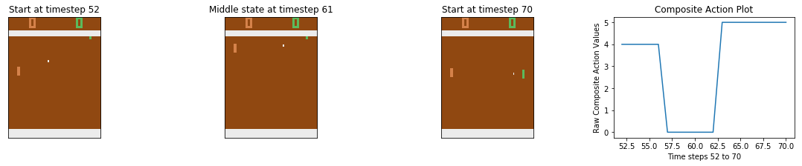

Above are the beginnings, middles, and ends of example composite actions found
during training of an RL agent. This demonstrates that even in early training, our
composite action extractor is able to find human discernible clusters of actions.

We have more examples in the `video_samples` directory. 

